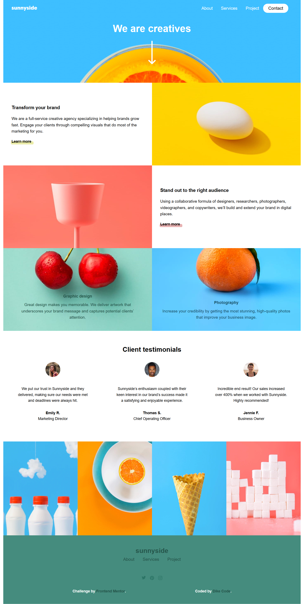
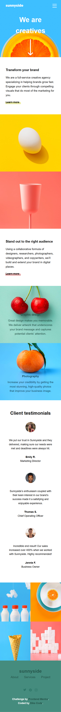
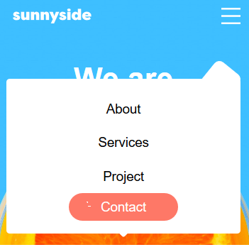

# Frontend Mentor - Sunnyside agency landing page solution

This is a solution to the [Sunnyside agency landing page challenge on Frontend Mentor](https://www.frontendmentor.io/challenges/sunnyside-agency-landing-page-7yVs3B6ef). Frontend Mentor challenges help you improve your coding skills by building realistic projects.

## Table of contents

- [Overview](#overview)
  - [The challenge](#the-challenge)
  - [Screenshot](#screenshot)
  - [Links](#links)
- [My process](#my-process)
  - [Built with](#built-with)
  - [What I learned](#what-i-learned)
  - [Continued development](#continued-development)
  - [Useful resources](#useful-resources)
- [Author](#author)
- [Acknowledgments](#acknowledgments)

A Sunny Agency Landing Page Solution from the Challange from Sidehustle by Frontend Mentor... it's built with a pure HTML5 for laying out the structure, Vanilla CSS for styling the website to make it more compelling, responsive and user.

### The challenge

Users should be able to:

-  See hover states for all interactive elements on the page

### Screenshot


 


### Links

-  Solution URL: [Solution](https://your-solution-url.com)
-  Live Site URL: [Live](https://perfectpeace.github.io/group-44-sunnyside-webpage-project/)

## My process

### Built with

-  Semantic HTML5 markup
-  CSS custom properties
-  Flexbox
-  CSS Grid
-  Desktop-first workflow
-  Javascript

### What I learned

I learnt all whole lot.

```html
  <!-- The Mobile togglebar check html elements -->
```

```css
  .navigation.active {
      position: absolute;
      top: 100%;
      left: 0;
      width: 100%;
      height: 50vh;
      opacity: 1;
      z-index: 1;
      background: transparent;
      transition: 0.5s;
   }

   .navbar {
      position: relative;
      background: #fff;
      flex-direction: column;
      justify-content: center;
      align-items: center;
      width: 100%;
      height: auto;
      border-radius: 5px;
      padding: 20px;
   }
   .navbar::after {
      content: "";
      position: absolute;
      top: 0;
      right: 0;
      width: 100px;
      height: 50px;
      background: var(--White);
      transform: rotate(-51deg) translate(4%, 0%);
      z-index: -1;
      border-radius: 10px;
   }
```

```js
const proudOfThisFunc = () => {
   console.log("🎉");
};
```

### Continued development

All, Practice... Practice and Practice.

### Useful resources

-  [SideHustle](https://www.sidehustle.com)- Sidehustle is a remote (online) internship program which proffers high-income skills which endows you with a lot of competative advantage towards landing a lucrative job... it's featured with well trained mentors who specializes in distinct field of professions and are invariably ready to give in their all for the progess of the intern cohorts. we've learnt at lot since we initiated our Journey with sidehustle as a team. 

-  [Youtube](https://www.youtube.com) - This is an amazing website/platform which helped me finally understand a lot including the snippets on buiding a dropdown list. I'd recommend it to anyone still learning this concept.

## Author

-  Frontend Mentor - [@Dike-Code](https://www.frontendmentor.io/profile/Dike-Code)

-  Github - [Dike.O.Clinton](https://www.github/Dike-Code)

## Acknowledgments

With utmost gratitude I'd like to acknowledge:
SideHustle,
Freecodecamp,
Youtube.
